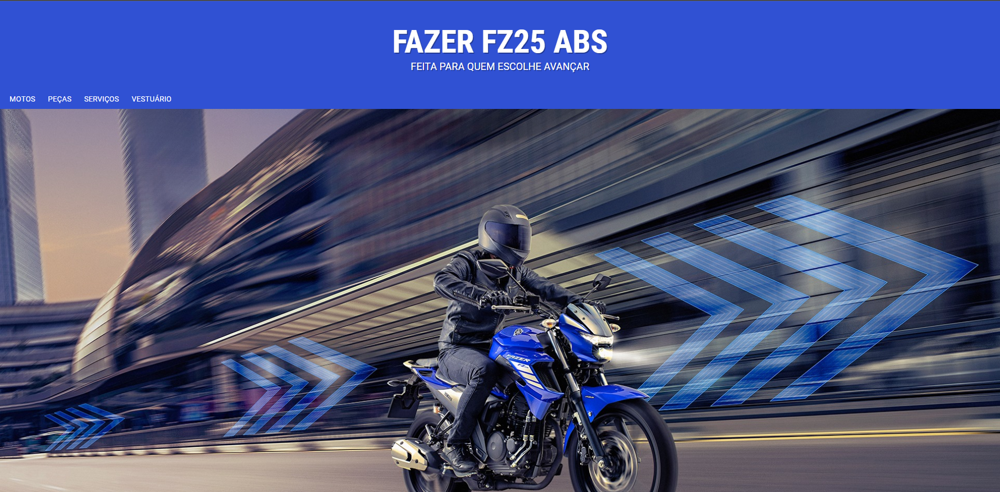

# Projeto Fazer Fz25
> Projeto feito para estudos com HTML5 e CSS3.
> 
> Apaixonado por motos resolvi juntar os dois mundos e praticar.
> 
> Usando apenas HTML e CSS, o objetivo desse site foi deixar ele responsivel.

## 🖥️ [Veja o site no ar](https://rfluan.github.io/projeto-fz25/)

